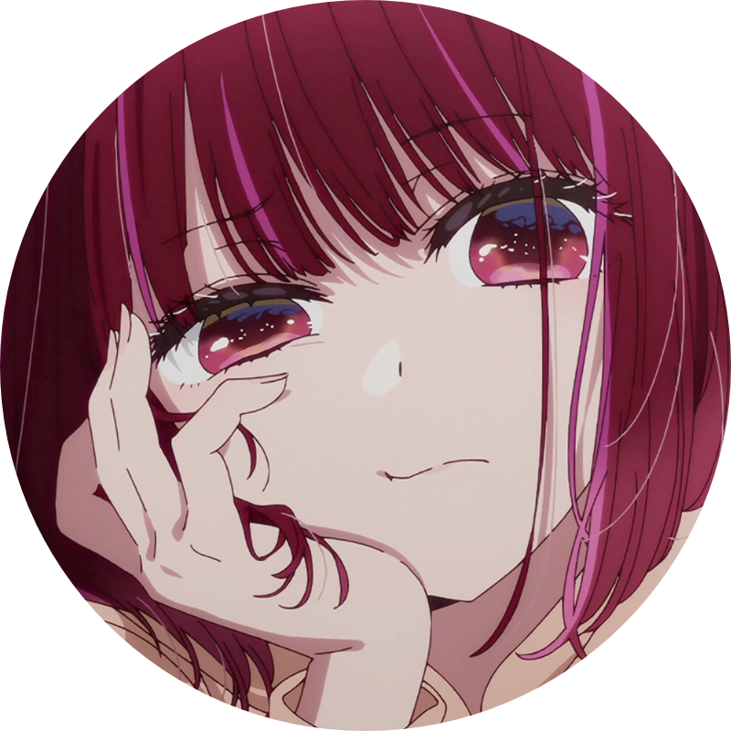
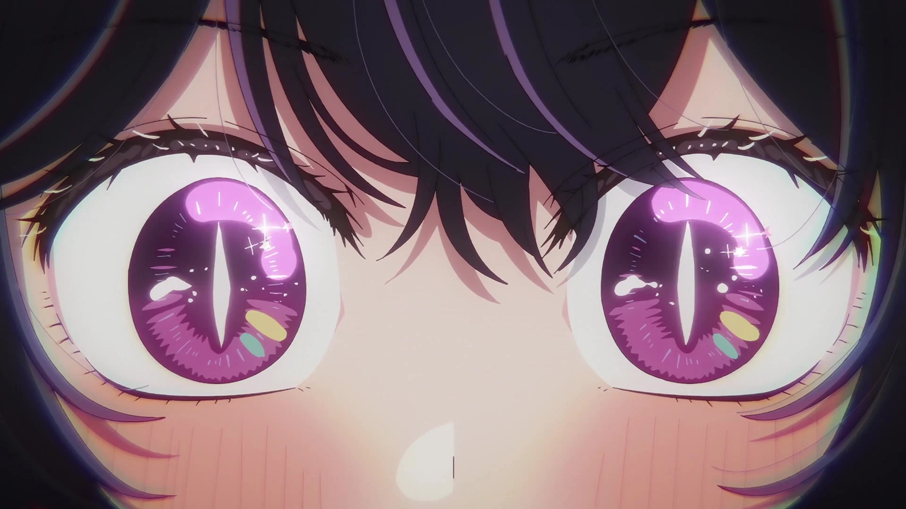

## Hey there! :)

# CRUGG

I'm a 19-year-old creative, web developer and ui/ux designer from Germany. I am entirely self-taught and am always eager to learn new things.

### What I'm currently up to

- I own and operate [Synchron Community](https://synchron.community), a German community project centered around the German dubbing industry.
- Under Synchron Community, I am currently working on an unannounced web application project.
- Every now and then, I write news articles for [aniSearch](https://anisearch.de), a German anime and manga database.
- For learning purposes, I'm also working on a personal side project which is a typical image board software (booru). It is built with TypeScript, Knex, Nunjucks Templating and SASS. This is my first real full-stack project that fully uses object-oriented programming and more.

### My interests

Honestly, I have a lot of interests. Some of them include anime, video games, user experience design, psychology, writing, music, German dubbing and voice actors, localization and translation, and a lot more.

### My tech stack

For web development, I usually use **SvelteKit** with **TypeScript**. For styling, I usually use **Tailwind**.

I am currently also experimenting with a more „old-school-ish“ stack using **Bun**, **TypeScript**, **Nunjucks**, **SASS** and **Knex**.

For deploying my applications, I usually use **Docker** on **Hetzner Cloud** servers.

  
See more

  
  Here's more technologies I use or have used in the past, with varying levels of proficiency:
  
* React, Next.js, Vue.js, Nuxt.js, Astro
* Express.js, Fastify, Prisma, discord.js, Zod, Tauri
* GraphQL, Redis, Socket.io
* Java, Kotlin, PHP
* Gitea, Forgejo, MediaWiki, Shimmie2, Uptime Kuma, Caddy, Jellyfin

### How to get in touch

You can best reach me via [email](mailto:me@crg.sh)! :)

<small><i>my profile picture and the other picture in this about me are from the anime “oshi no ko”</i></small>

